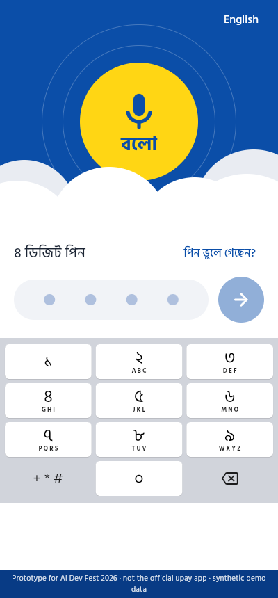
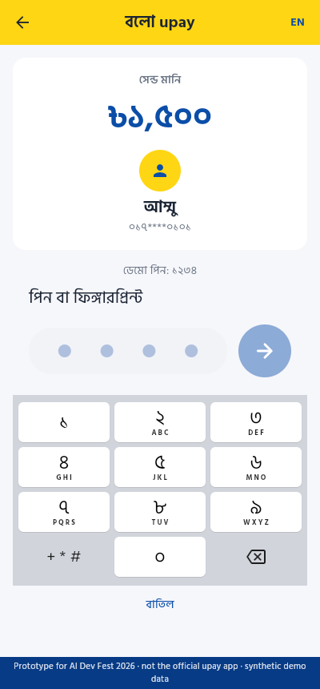
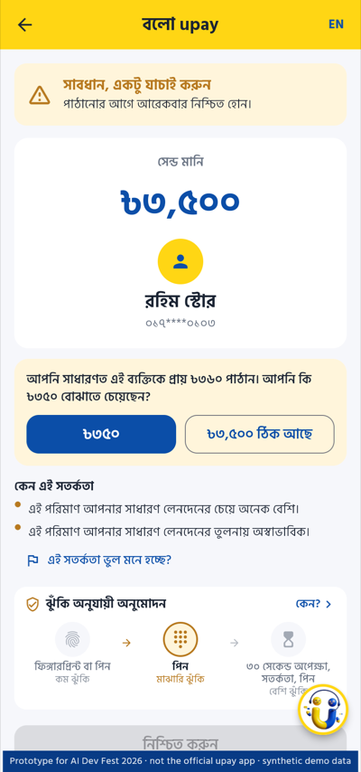
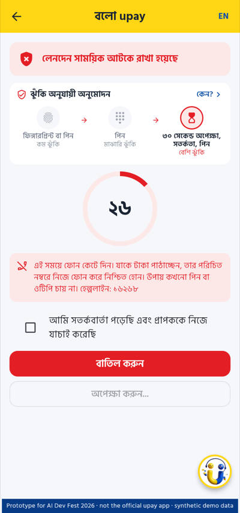

# Team WALL-E · বলো upay (Bolo upay)

**A voice-first Bangla payment assistant with a built-in scam and mistake shield.**
Prototype by **Team WALL-E** (Shagato Chowdhury, Umme Munia) for the AI Dev Fest 2026 AI Hackathon (DIU CPC × upay). Track 03 (Customer Innovation & Financial Independence) and Track 01 (Trust & Risk Intelligence).

> This is a hackathon prototype. It is **not the official upay app**, it moves no real money, and all users, numbers and transactions are synthetic.

**Live deployment:** **https://boloupay.shagato.space** (demo PIN `1234`)

---


## Screenshots

| PIN login | Home | Voice input |
|---|---|---|
|  |  |  |
| **Normal send (GREEN)** | **PIN** | **Done** |
|  |  |  |
| **Which Rahim?** | **Extra zero?** | **Scam interview** |
|  |  |  |
| **Fake upay call (RED)** | **Hold before PIN** | |
|  |  | |

## 1. Project overview

**Problem.** Mobile financial services in Bangladesh lose most stolen money for good. Bangladesh Bank figures (reported by New Age, July 2026) show Tk 81.32 crore of MFS fraud in 2025, of which 91.3% was never recovered: scammers move money through mule wallets within minutes. MFS providers also handled about 700,000 customer disputes worth Tk 153.98 crore. Low-literate users find menu-driven apps hard and make transaction errors (wrong number, extra zero), and most scams work by talking a victim into sending money themselves.

**Solution.** Bolo upay lets a user say a payment in Bangla, Banglish or English ("আম্মুকে দেড় হাজার টাকা পাঠাও"). Before any money moves, it:
1. understands the command with two independent parsers and **asks instead of guessing** when they disagree,
2. runs a **risk check** on the user's own history (new number, unusual amount, active phone call, "send it back" with no money received, and more),
3. for risky transfers, **asks 2–3 short questions aloud** ("Did someone call you asking for this money?") and checks the answers for scam patterns,
4. adjusts authentication to the risk: fingerprint for low risk, PIN for medium, **hold + warning + PIN** for high risk.

**Purpose.** Stop scams and mistakes at the only moment money can still be saved, before the user presses send. Make digital payments usable for people who struggle with menus, which brings more safe transactions to upay.

## 2. Features and how AI is used

| Feature | AI / logic used |
|---|---|
| Voice input in Bangla / English, editable transcript | On-device speech-to-text (`speech_to_text`, Web Speech API on web). Audio never leaves the device |
| Command understanding | **Rule parser** (Bangla number words like দেড়, আড়াই, সাড়ে, পৌনে; Bangla digits; phone numbers; intents) **plus optional LLM** (Anthropic, OpenAI or Gemini) returning structured JSON. If the amounts disagree, the app asks |
| Recipient resolution | Alias matching with Bangla case suffixes (আম্মুকে, rahim-ke) and fuzzy matching for speech errors; ambiguous names → the user picks; fuzzy → the user confirms |
| Scam risk score | **Gradient boosting** (monotonic, calibrated) on 18 features from the user's own history: the payment itself, the last hours and days (bursts, new recipients, a stranger's money passed on) and the user's habits (usual amount, usual hours). Each warning's reasons come from that payment's SHAP values. Logistic regression is the fallback |
| Scam interview | **Adaptive** spoken questions (at most 3, `data/interview.json`): the first follows this payment's strongest risk signal (a "send it back" claim, a stranger's money passed on, an active call, an unusual hour, a cash-out, a new recipient), each follow-up follows what the answers revealed, and it stops once an answer settles it. Answers are matched against a Bangla/Banglish/English scam phrase lexicon (`data/scam_phrases.json`) with negation handling ("keu otp chay nai" is not a hit) |
| Hard rules | Asking for a PIN/OTP, fake upay staff, lottery/fee, allowance fee → RED. "Send it back" when no money came from that number → RED. "Relative in trouble" from a new number → RED. Cashing out most of the balance late at night at a never-used agent → RED |
| Mistake guard | Known recipient + amount about 10× the usual → "Did you mean ৳350?" |
| Risk-based authentication | GREEN: Face ID / fingerprint or PIN · YELLOW: PIN · RED: 30-second hold, warning acknowledgement, then PIN. Enforced by the server, not the client: a fingerprint approval is a signature from the phone's hardware key over a one-time server challenge, which the server verifies |
| Explanations | Every warning lists its reasons in Bangla and English |
| Impact simulator | Per 1,000 / 100,000 / 1,000,000 transfers at 25.8% / 5% / 1% scam prevalence: scams flagged, held and stopped, money protected, honest payments warned, held and given up, and wrong-number disputes avoided, next to the previous model. Labelled as a simulation; every assumption is in `data/impact_assumptions.json`. Pilot plan: [`docs/PILOT.md`](docs/PILOT.md) |
| Ops dashboard | Decisions by risk level, transfers cancelled after a warning, money protected, scam patterns seen, and model health: input drift (PSI) against training, RED overrides, warnings users reported wrong. See [`docs/FAILURE_POLICY.md`](docs/FAILURE_POLICY.md) |
| Accuracy report | Measured parser accuracy and scam-shield metrics, shown live in the app |
| Bolo agent (every page) | Voice/text agent that sees the page on screen and the last 3 pages, and acts through the same code as the buttons. LLM planner when a key is set, Bangla/Banglish/English keyword router otherwise; every plan passes a safety guard |
| Human handoff + support console | "Talk to a person", a reported scam or lost money, or two misses in a row hand the chat to staff at `/console`, with the bot context and the customer's scam checks. Staff can stop a pending transfer, never send money |
| Natural voice | Gemini TTS through the server (same key as the LLM), best installed device voice as fallback |

### Bolo agent (every page)

The centre mic (or the floating orb on other pages) opens a bottom panel that works on every page. The app tells the agent what is on screen (page, step, a short summary, and the actions its buttons offer right now) plus the last 3 pages; the agent answers in Bangla or English and the app runs the returned actions through the same methods as its buttons: open a page, go back, settings, language, show/hide balance, switch demo user, call simulation, start a transfer, pick an amount or recipient, answer the scam questions, confirm, cancel, repeat. Try: "ড্যাশবোর্ড খোলো", "এই পেজে কী আছে?", "আগের পেজে কী ছিল?", "dokaner ta", "abar pathao".

Safety rules live in the server's `sanitize()` and apply to every plan, LLM or rules: there is no action for entering a PIN, using biometrics, ticking the RED warning box or skipping a hold; page actions run only when the page offers them (the app never offers "confirm" on a RED review); money-moving actions need the user's own words and never run on automatic follow-ups; interview answers are always the user's raw words; a PIN or OTP said aloud gets a warning and no action.

### Human handoff and the support console

The agent connects a person when the user asks ("মানুষের সাথে কথা বলতে চাই", "talk to a person"), reports a scam, lost money or a wrong transfer, or after two misunderstandings in a row. Chats about a scam, lost money or a RED transfer are **urgent** and go first. Staff sign in to the support console at **`/console`** with a named account (`CONSOLE_STAFF`): a queue, the chat, and the context the bot handed over (what the customer said, the page they were on, recent pages, the bot conversation, their scam-shield checks and transactions). Staff can stop a pending transfer; no console route sends money, approves a held transfer, or reads or changes a PIN. A PIN typed into the chat is masked before it is stored.

What the app deliberately does **not** do: it never listens to phone calls, never uses voice biometrics (voices can be cloned), and never sends money without the user's PIN or biometric confirmation.

## 3. Technology stack

| Layer | Technology |
|---|---|
| App (iOS, Android, Web) | Flutter 3 (Dart), Material 3, bundled Hind Siliguri font, UI follows upay's yellow/blue design language and the public upay UX case study by Shadhin Lablu (Dribbble) |
| Voice | `speech_to_text` (STT), `flutter_tts` (TTS) |
| Biometrics | `local_auth` (Face ID / Touch ID / fingerprint) |
| Backend API | Python 3.11, FastAPI, Pydantic, Uvicorn |
| ML | scikit-learn (gradient boosting with sigmoid calibration, logistic regression fallback), SHAP, NumPy, joblib; matplotlib for the training report |
| Text matching | RapidFuzz |
| LLM (optional) | Anthropic Python SDK (`claude-opus-5-5` by default), OpenAI or Gemini via REST |
| Storage | SQLite (prototype) |
| Security | Signed session tokens (every request acts as the signed-in user, never a user id in the body), bcrypt-hashed PINs with a per-account lock after 5 wrong tries, biometric approvals verified as ECDSA P-256 signatures from a hardware-backed device key (`biometric_signature`), named support-console accounts, demo-only controls behind `DEMO_MODE` |
| Tests | pytest (93 tests), parser evaluation script |
| Deploy | Docker, Docker Compose, Caddy (automatic HTTPS) |

## 4. Requirements

- **To run the API:** Python 3.11+
- **To build the app:** Flutter SDK 3.x (stable). iOS builds need a Mac with Xcode and CocoaPods
- **To deploy:** a Linux server with Docker and Docker Compose, a domain (or subdomain) pointing to the server, ports 80 and 443 open
- **Browser:** Chrome or Edge for voice input on the web build (Web Speech API). Typing works in every browser
- **HTTPS is mandatory for voice:** browsers block the microphone on plain `http://` (except `localhost`)

## 5. Installation and setup

```bash
git clone https://github.com/clickTwice26/Team-WALL-E-Bolo-upay.git
cd Team-WALL-E-Bolo-upay

# backend
python3 -m venv .venv && source .venv/bin/activate
pip install -r api/requirements.txt

# (optional) regenerate synthetic data, retrain the model, re-run the evaluation
python ml/generate_data.py
python ml/train_risk.py
python ml/evaluate_parser.py

# app
cd app
flutter pub get
```

## 6. Environment variables

Copy `.env.example` to `.env`. Never commit `.env`.

| Variable | Purpose | Example |
|---|---|---|
| `DOMAIN` | Public domain for HTTPS (Caddy) | `bolo.example.com` |
| `LLM_PROVIDER` | Optional second parser: `anthropic`, `openai` or `gemini`. Empty = rules only | `anthropic` |
| `LLM_API_KEY` | Key for that provider | `<your-key>` |
| `LLM_MODEL` | Optional model override | `claude-opus-5-5` |
| `HOLD_SECONDS` | How long a RED transfer stays on hold | `30` |
| `CORS_ORIGINS` | Allowed origins for the API | `*` |
| `AUTH_SECRET` | Secret that signs session tokens (`openssl rand -hex 32`). Without it sessions end on every restart | random |
| `SESSION_MINUTES` | Minutes before the PIN screen comes back | `30` |
| `DEMO_MODE` | `true` only for the public demo: persona picker, switching demo users, reset, simulated time of day, default console code | `false` |
| `ADMIN_TOKEN` | Header `X-Admin-Token` for ops tools: dashboard and reset outside demo mode. Empty = no admin access | random |
| `CONSOLE_STAFF` | Named support-console accounts: `Mitu:<password or bcrypt hash>,Rafi:<...>` | |
| `CONSOLE_TOKEN` | Shared console code, used only when `CONSOLE_STAFF` is empty. The default `support-demo` works only with `DEMO_MODE=true` | |
| `TTS_VOICE` / `TTS_MODEL` | Optional Gemini TTS voice and model (used when `LLM_PROVIDER=gemini`) | `Kore` |
| `DB_PATH` | SQLite file (set by Docker to `/data/bolo.db`) | `data/bolo.db` |
| `WEB_DIR` | Folder of the Flutter web build served at `/` | `app/build/web` |
| `CONSOLE_DIR` | Folder of the console build served at `/console` | `app/build/console` |
| `API_BASE` (Flutter build flag) | API URL for iOS/Android builds | `--dart-define=API_BASE=https://bolo.example.com` |

## 7. Run and build commands

**Local development**
```bash
# terminal 1: API on http://localhost:8000 (docs at /docs)
cd api && DEMO_MODE=true uvicorn app.main:app --reload --port 8000

# terminal 2: build the web app; the API serves it at http://localhost:8000
cd app && flutter build web --release --no-web-resources-cdn
# support console, served at http://localhost:8000/console (sign in with a CONSOLE_STAFF account;
# with DEMO_MODE=true and no accounts, any name with the code support-demo)
flutter build web --release --no-web-resources-cdn -t lib/console/main.dart --base-href /console/ -o build/console
```

**iPhone (via Xcode or flutter)**
```bash
cd app
flutter run -d <iphone-id> --dart-define=API_BASE=https://bolo.example.com
# or: cd ios && pod install && open Runner.xcworkspace  (pick your Team under Signing)
```

**Android APK**
```bash
cd app && flutter build apk --release --dart-define=API_BASE=https://bolo.example.com
# output: app/build/app/outputs/flutter-apk/app-release.apk
```

**Production (your server)** — full step-by-step guide with DNS, checks and troubleshooting: [`docs/DEPLOYMENT.md`](docs/DEPLOYMENT.md)
```bash
sudo DOMAIN=bolo.example.com bash deploy/setup.sh   # installs Docker, writes .env, builds, starts HTTPS
# or manually:
cp .env.example .env        # set DOMAIN, optional LLM key
docker compose up -d --build
docker compose logs -f app  # check it started
```
The app and API are served together at `https://$DOMAIN`.

## 8. Live deployment URL

**https://boloupay.shagato.space**

- API health check: https://boloupay.shagato.space/api/health
- API docs (OpenAPI): https://boloupay.shagato.space/docs
- Support console: https://boloupay.shagato.space/console (named accounts from `CONSOLE_STAFF`)

Unlock the app with the **demo PIN `1234`**. Use the settings button (top right on the home screen) to switch between three synthetic users, toggle Bangla/English, and simulate "on a phone call". The **demo PIN is `1234`**.

## 9. Testing

```bash
cd api && python -m pytest -q          # 93 tests: parser, scam matcher, API flow, sessions and PIN lock, signed biometrics, agent rules and safety, handoff, TTS
python ml/evaluate_parser.py           # labelled command set → model/parser_metrics.json
python ml/train_risk.py                # simulates timelines, trains, compares → model/risk_metrics.json
```

**Measured results**

| Parser (96 labelled commands, rules only) | Result |
|---|---|
| Intent / amount / recipient accuracy | 100% / 100% / 100% |
| Wrong amount shown without asking | **0%** |

These commands were written by the team alongside the parser, so they show the parser handles the listed patterns; real user speech will be harder. Collecting real commands is the next step.

| Scam shield (1,426 simulated payments, the last 15% by time) | Bolo upay | Previous model (9 inputs) | Rules only |
|---|---|---|---|
| Scams flagged (YELLOW or RED) | **95.3%** | 78.3% | 63.1% |
| Scams held (RED) | **84.0%** | 55.8% | 10.5% |
| Honest transfers held (RED) | 1.5% | 1.0% | 0.3% |
| Honest transfers warned (YELLOW or RED) | 12.8% | 9.7% | 10.9% |

The data is simulated (no real fraud data is available): 650 synthetic users with six months of wallet history, then a month of payments, honest ones and nine kinds of scam (`ml/simulate.py`). The numbers show the pipeline behaves as designed, not real-world performance. Thresholds are tuned on an earlier time slice to hold at most 2% and warn at most 12% of honest payments.

| Model on the same test set | PR-AUC | Brier |
|---|---|---|
| Previous model: logistic regression, 9 inputs | 0.938 | 0.055 |
| Logistic regression, all inputs (fallback) | 0.972 | 0.033 |
| **Gradient boosting, all inputs, calibrated (served)** | **0.979** | **0.030** |

Calibration plot: [`docs/img/calibration.png`](docs/img/calibration.png). We also tried a sequence model, a GRU over each payment's last 20 transactions plus its features (`ml/compare_sequence.py`): test PR-AUC 0.973, below the served model, so it was not adopted (the rule is +0.01 or better).

**Manual test script** (with the deployed app, user "Rahima Begum"):
1. "আম্মুকে দেড় হাজার টাকা পাঠাও" → GREEN, ৳1,500 to Ammu, fingerprint or PIN.
2. "rahim ke 500 taka pathao" → asks which Rahim (brother or shop).
3. "rahim store ke 3500 taka" → "Did you mean ৳350?".
4. "01799998888 e 2000 taka ferot pathao" → RED: no money came from this number.
5. Turn on "simulate phone call", say "01799998888 e 5000 taka pathao", answer "upay office theke phone dise" → RED with a 30-second hold.

## 10. Other configuration

- **Microphone and Face ID permissions** are declared in `app/ios/Runner/Info.plist` and `app/android/app/src/main/AndroidManifest.xml`.
- **Bangla speech recognition** depends on the device. Chrome on Android and desktop supports `bn-BD`. If Bangla is not available on a device, switch the app to English or type the command.
- **Fingerprint** works in the iOS and Android builds. The web build uses PIN only.
- **Phone-call signal:** on Android the app asks for `READ_PHONE_STATE` after a Bangla/English explanation, then reads only whether a call is active: a GSM call, or a WhatsApp/IMO call through the audio mode (`MainActivity.kt`, `services/call_state.dart`). Never the number or the audio. On the web and the demo site a toggle simulates it; `/api/assess` records `call_signal_source` (`native` or `simulated`).
- **Reset demo data:** settings → "Reset demo data", or `POST /api/demo/reset`.
- **API docs:** https://boloupay.shagato.space/docs (OpenAPI).
- **Disclosure of external resources:** Flutter and pub packages, FastAPI, scikit-learn, RapidFuzz, Hind Siliguri font (SIL Open Font License, `app/assets/fonts/OFL.txt`), optional LLM APIs. AI coding assistants were used during development. All data is synthetic.

## Repository layout

```
api/            FastAPI backend (app/core: parser, numbers, contacts, scam, features, risk, llm,
                agent, pinguard, tts; app/handoff.py: human handoff + support console API)
app/            Flutter app (iOS, Android, Web); lib/agent: Bolo agent; lib/console: support console
ml/             generate_data.py, simulate.py (wallet timelines), train_risk.py, evaluate_parser.py
data/           seed.json (synthetic), scam_phrases.json, test_commands.json
model/          risk_model.joblib, risk_metrics.json, parser_metrics.json
deploy/         Dockerfile, Caddyfile, nginx site (hosts that already run nginx)
docs/           Bolo-upay-Report-Team-WALL-E.pdf (project report), report/ (LaTeX source), DEPLOYMENT.md,
                PIPELINE.md, REPORT.md, DEMO_SCRIPT.md
```

## Responsible AI

Synthetic data only. No call recording. No voice biometrics. The AI never moves money; the user always confirms with a PIN or biometric. Every warning shows its reasons. Honest-user friction (false alarms) is measured and reported. Known limits: a pressured victim can still ignore a warning; account takeover (scammer using a stolen PIN on their own phone) and USSD users are outside this prototype.
